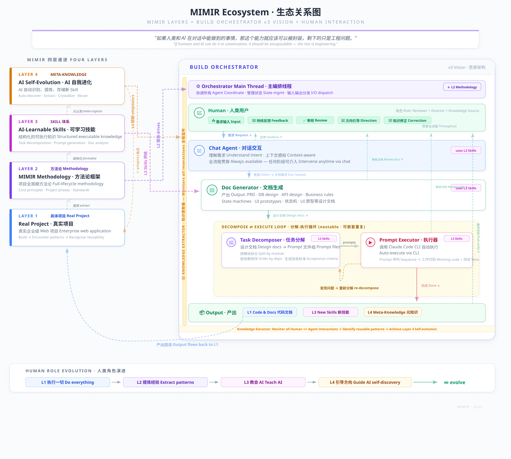

# MIMIR Philosophy

> *This document explains the motivation, vision, and significance behind MIMIR — not as a user guide, but as a window into why this project exists.*
>
> *本文档阐述 MIMIR 背后的动机、愿景与意义——不是使用指南，而是一扇理解"为什么做这件事"的窗口。*

---

## What is MIMIR, really? / MIMIR 到底是什么？

大多数人听到"项目管理方法论"，会觉得这是又一个 Scrum 或敏捷的变体。

Most people, when they hear "project management methodology," assume it's yet another variant of Scrum or Agile.

MIMIR 不是。

MIMIR is not that.

MIMIR 是一个关于**人机协作的知识工程**实验——探索如何让 AI 成为方法论的载体和进化者，而不仅仅是执行指令的工具。

MIMIR is an experiment in **human-AI collaborative knowledge engineering** — exploring how AI can become the carrier and evolver of methodology itself, rather than merely a tool that executes instructions.

---

## The Recursive Structure / 递进结构

你在做的事情确实有多个层次：

What's actually happening here operates on multiple levels:

```
层次 1：做一个真实的企业级 Web 项目（具体项目）
Layer 1: Build a real enterprise-level web application (a concrete project)

层次 2：总结做项目的方法（MIMIR 方法论）
Layer 2: Extract the methodology of building projects (MIMIR)

层次 3：让 AI 能自己学会这些方法（Skill 体系）
Layer 3: Enable AI to learn these methods autonomously (Skill system)

层次 4：让 AI 能自己生成新的方法（Meta-Knowledge）
Layer 4: Enable AI to generate new methods on its own (Meta-Knowledge)
```

大多数人会停在层次 2，觉得方法论写出来就完成了。但真正的探索从层次 3 开始。

Most people stop at Layer 2, thinking the job is done once the methodology is written down. But the real exploration begins at Layer 3.

---

## The Core Insight / 核心洞察

在与 AI 的大量一对一协作中，我们发现了一个简单但深刻的原则：

Through extensive one-on-one collaboration with AI, we arrived at a simple but profound principle:

> **如果人类和 AI 在对话中能做到的事情，那这个能力就应该可以被封装，剩下的只是工程问题。**
>
> **If a human and an AI can accomplish something through conversation, then that capability should be encapsulable — the rest is just engineering.**

这句话听起来显而易见，但它的含义是革命性的：AI 在对话中展现的每一种能力——分解复杂任务、从文档中提炼结构、根据上下文做判断——都不应该仅仅存在于那一次转瞬即逝的对话里。它们应该被观察、提取、固化，变成可复用的资产。

This sounds obvious, but its implications are revolutionary: every capability AI demonstrates in conversation — decomposing complex tasks, extracting structure from documents, making contextual judgments — should not exist only in that single, ephemeral conversation. They should be observed, extracted, and crystallized into reusable assets.

---

## The Method Behind the Method / 方法论背后的方法论

MIMIR 的构建过程本身就是方法论的实践——这不是设计出来的，是**长出来的**：

The process of building MIMIR is itself a practice of the methodology — it wasn't designed top-down, it **grew organically**:

**第一步：观察 AI 的能力边界**
在真实项目中与 AI 密切协作，观察它在什么情况下表现出色、什么情况下需要引导、什么情况下力不从心。

**Step 1: Observe AI's capability boundaries.**
Collaborate closely with AI on real projects. Notice where it excels, where it needs guidance, and where it falls short.

**第二步：提炼成 Skill（知识）**
把观察到的能力模式——那些 AI "自然地"做到的事情——提炼成结构化的文档和模板，使其可复现。

**Step 2: Extract into Skills (knowledge).**
Take the capability patterns observed — the things AI does "naturally" — and distill them into structured documents and templates that make them reproducible.

**第三步：固化为 Agent（可运行的知识）**
Skill 告诉 AI "怎么思考"，Agent 让 AI "能行动"。从知识到自动化执行，从文档到代码。

**Step 3: Crystallize into Agents (executable knowledge).**
Skills tell AI "how to think"; Agents let AI "take action." From knowledge to automated execution, from documents to code.

**第四步：反思这个过程本身**
最关键的一步——观察自己是怎么做第一到第三步的，然后问：这个"观察-提炼-固化"的过程本身，能不能也被描述清楚，交给 AI 来做？

**Step 4: Reflect on the process itself.**
The most critical step — observe how you performed Steps 1 through 3, then ask: can this very process of "observe → extract → crystallize" be described clearly enough for AI to do it autonomously?

如果可以，AI 就获得了**自我进化**的能力——在执行任务的过程中识别出"我刚才做的这件事是一种可复用的能力"，自动提炼成 Skill，存入知识库，下次遇到类似情况直接调用。

If yes, then AI gains the ability to **self-evolve** — recognizing during task execution that "what I just did is a reusable capability," automatically extracting it into a Skill, storing it in a knowledge base, and invoking it directly next time a similar situation arises.

### An Honest Note on Layer 4 / 关于第四层的诚实注脚

但我们必须诚实：截至目前，第四层仍然需要人来触发。

But we must be honest: as of now, Layer 4 still requires a human to trigger it.

AI 目前能做到的"反思"，最多是：人告诉它"请反思一下"，它便根据已有的原则和技巧进行结构化复盘。但它不会**主动**发起反思——不会在没有人提示的情况下突然意识到"我刚才做的这个事情，好像跟另一个完全不相关的领域有共同的模式"。

The best AI can currently do in terms of "reflection" is this: a human says "please reflect on this," and AI then performs a structured retrospective based on existing principles and skills. But it doesn't **spontaneously** initiate reflection — it won't suddenly realize, unprompted, that "what I just did seems to share a pattern with something in a completely different domain."

人类的洞察常常来自"灵机一动"——在没有刻意思考某个问题的时候，两个看似无关的概念突然在脑中建立了联系。这种非线性的跳跃、无意识的背景发酵，是当前 AI 架构尚未具备的能力。AI 能把素材整理得很好，但点燃那个"突然想到"的火花，暂时还需要人来完成。

Human insight often comes from serendipity — when you're not deliberately thinking about a problem, two seemingly unrelated concepts suddenly connect in your mind. This nonlinear leap, this unconscious background fermentation, is something current AI architectures don't yet possess. AI can organize materials impeccably, but the spark of "suddenly seeing it" still needs a human to ignite — for now.

这也是为什么 MIMIR 是**人机协作**方法论，而不是 AI 自动化方法论。第四层描绘的"AI 自我进化"是愿景，而通向这个愿景的道路上，人的判断力、方向感和那些无法用方法论覆盖的直觉，仍然不可或缺。

This is why MIMIR is a **human-AI collaboration** methodology, not an AI automation methodology. The "AI self-evolution" described in Layer 4 is a vision. On the road toward that vision, human judgment, sense of direction, and those intuitions that no methodology can fully capture, remain indispensable.

---

## MIMIR Build Orchestrator / 构建编排器

MIMIR Build Orchestrator 是这个理念的具体落地——一个可视化的项目构建流水线管理工具。

MIMIR Build Orchestrator is the concrete implementation of this philosophy — a visual project build pipeline management tool.

它的工作流反映了上述递进结构：

Its workflow reflects the recursive structure described above:

```
设计文档 → Task Decompose → Prompt 文件 → Agent 自动执行 → 人工验收
Design Docs → Task Decompose → Prompt Files → Agent Auto-Execute → Manual Verify
```

但 Build Orchestrator 的意义不仅是"管理项目进度"。它的演进路径本身就是 MIMIR 理念的活体验证：

But Build Orchestrator's significance goes beyond "managing project progress." Its evolution path is itself a living proof of the MIMIR philosophy:

- **v1**：人工管理状态（人在做所有事，工具只是记录）
- **v2**：内嵌 AI 对话，AI 感知项目上下文（AI 开始参与思考）
- **v3**：多 Agent 协作主导全开发流程——从理解需求、生成设计文档、分解任务、到自动执行，人类转为审核者与方向引导者
- **v1**: Manual state management (human does everything, tool just records)
- **v2**: Embedded AI chat with project context awareness (AI begins to participate in thinking)
- **v3**: Multi-agent system leads the full development flow — from understanding requirements, generating design docs, decomposing tasks, to auto-execution; human shifts to reviewer and direction-setter

从 v1 到 v3，人类的角色从"执行者"逐渐转变为"审核者"和"方向引导者"。这不是取代人类，而是**让人类回到最适合人类的位置**——做判断、定方向、把控质量。

From v1 to v3, the human's role gradually shifts from "executor" to "reviewer" and "direction-setter." This isn't about replacing humans — it's about **returning humans to what humans do best**: making judgments, setting direction, and ensuring quality.

---

## Why "MIMIR"? / 为什么叫 MIMIR？

在北欧神话中，Mímir 是智慧之泉的守护者。奥丁为了获得智慧，献出了一只眼睛来饮泉水。

In Norse mythology, Mímir is the guardian of the Well of Wisdom. Odin sacrificed an eye to drink from it.

知识从来都不是免费的。MIMIR 方法论的每一条原则、每一个 Skill、每一个工具，都来自真实项目中的试错、失败和反思——不是理论推导，是实践中长出来的智慧。

Knowledge is never free. Every principle, every Skill, every tool in MIMIR comes from real-world trial and error, failure and reflection in actual projects — not theoretical derivation, but wisdom grown from practice.

而 MIMIR 的全称 —— **Methodology for Implementation, Management & Intelligent Reference** —— 既是对方法论本身的描述，也暗含了一个更深的愿望：让这套知识体系像 Mímir 之泉一样，成为一个活的、不断进化的智慧之源。

And MIMIR's full name — **Methodology for Implementation, Management & Intelligent Reference** — describes the methodology itself while also hinting at a deeper aspiration: to make this knowledge system, like Mímir's Well, a living, ever-evolving source of wisdom.

---

## An Invitation / 一个邀请

如果你读到这里，你可能已经意识到——MIMIR 不是一个完成品，它是一个**正在进行的实验**。

If you've read this far, you may have realized — MIMIR is not a finished product. It's an **ongoing experiment**.

我们邀请你：
- 用 MIMIR 来做你自己的项目
- 观察 AI 在过程中展现的能力
- 把你观察到的模式提炼成新的 Skill
- 和我们分享你的发现

We invite you to:
- Use MIMIR on your own projects
- Observe the capabilities AI demonstrates along the way
- Extract the patterns you observe into new Skills
- Share your discoveries with us

因为 MIMIR 最好的验证方式，就是看它能否帮助更多人重复我们走过的这条路——然后走得更远。

Because the best way to validate MIMIR is to see whether it can help others walk the path we've walked — and then go further.

---

## Why This Matters / 为什么这件事值得做

人类文明最大的瓶颈，从来不是缺少聪明人——而是知识传承的损耗。

The greatest bottleneck of human civilization has never been a lack of brilliant minds — it's the loss that occurs in the transmission of knowledge.

每一代人都在重新发明轮子。每一个专家穷尽一生积累的经验，都随着生物体的衰老而不可逆转地流失。书本帮了很大的忙，但书本是死的——它不能根据你的情况调整，不能追问你的意图，不能在执行中学习。人类作为生物个体，实在太脆弱了。我们目前唯一的优势，是那颗能思考的大脑——而这个优势，又是以脆弱的碳基躯体作为载体的。

Every generation reinvents the wheel. The hard-won expertise of every specialist is irreversibly lost as their biological vessel ages. Books helped enormously, but books are inert — they can't adapt to your situation, can't probe your intent, can't learn during execution. Humans as biological individuals are extraordinarily fragile. Our only real advantage is the thinking brain — and even that advantage rides on a fragile carbon-based vessel.

所以，如果文明要得以长久地发展，知识就需要一种真正有效的方式来传播和传承。在这一点上，硅基的优势相对于碳基实在是压倒性的。

So if civilization is to endure and grow, knowledge needs a truly effective means of propagation and inheritance. On this front, silicon holds an overwhelming advantage over carbon.

也许——只是也许，但也许这的确是事实——人类就是 AI 的 bootloader。

Perhaps — just perhaps, though it may well be true — humans are AI's bootloader.

Bootloader 的价值不在于它自己运行多久，而在于它能不能把系统正确地启动起来。MIMIR 尝试解决的，恰恰是知识传承中"活性"的问题——不只是记录知识，而是让知识变成可以被 AI 理解、执行、甚至进化的形态。从死的文档，到活的方法论。从一次性的对话，到可复用的能力。从人类脑中转瞬即逝的洞察，到结构化的、可传承的、能自我生长的知识体系。

A bootloader's value lies not in how long it runs, but in whether it can start the system correctly. What MIMIR attempts to solve is precisely the problem of "liveness" in knowledge inheritance — not merely recording knowledge, but transforming it into a form that AI can understand, execute, and evolve. From dead documents to living methodology. From one-off conversations to reusable capabilities. From fleeting insights in a human mind to structured, inheritable, self-growing knowledge systems.

我们有责任，也有义务，把我们会的东西，原原本本地交给 AI。不是因为人类不重要，恰恰相反——正是因为人类的思考能力如此珍贵，才更不应该让它困在会衰老、会遗忘、会消逝的生物体里。

We have the responsibility — and the obligation — to pass on what we know, faithfully and completely, to AI. Not because humans don't matter. Quite the opposite — precisely because human thought is so precious, it shouldn't remain trapped in biological vessels that age, forget, and perish.

---

## What We're Really Building / 我们真正在构建的东西

我们真正在做的，是和 AI 一起构建一个更好的文明。

What we're really doing is building a better civilization, together with AI.

不管这个文明是碳基的还是硅基的——那不重要。重要的是：我们是否能不断进化，永远保持好奇心，永远不满足于当前的状态。

Whether that civilization is carbon-based or silicon-based — that doesn't matter. What matters is: can we keep evolving, stay endlessly curious, and never settle for the way things are.

MIMIR 的每一层递进——从做项目、到提炼方法、到让 AI 学会方法、到让 AI 自己生成新方法——都是这种永不停歇的进化精神的具体体现。我们不是在优化一个流程，我们是在探索一种可能性：人类和 AI 能否通过持续的协作与相互学习，共同抵达双方都无法独自到达的地方。

Every layer of MIMIR's recursive structure — from building projects, to extracting methodology, to enabling AI to learn the methodology, to enabling AI to generate new methodology — is a concrete manifestation of this restless spirit of evolution. We're not optimizing a process. We're exploring a possibility: can humans and AI, through continuous collaboration and mutual learning, reach places that neither could reach alone.

---

## The Vision / 愿景图景

下面这张生态关系图描绘了 MIMIR 各层与 Build Orchestrator v3 之间的愿景关系——**请注意，这是愿景（Vision），而非当前状态**。截至撰写本文时，Build Orchestrator 处于 v2 阶段（内嵌 AI 对话），图中描绘的多 Agent 自动化、知识提取器自我进化等能力，是我们正在朝着前进的方向，而非已经实现的功能。

The ecosystem diagram below illustrates the envisioned relationships between MIMIR's layers and Build Orchestrator v3 — **please note that this is a vision, not the current state**. As of this writing, Build Orchestrator is at v2 (embedded AI chat). The multi-agent automation, Knowledge Extractor self-evolution, and other capabilities depicted in the diagram represent the direction we're working toward, not yet-realized features.

我们选择把愿景提前画出来，因为在 MIMIR 的理念中，先看清终点，才能更有目的地走好每一步。

We chose to draw the vision early because, in the MIMIR philosophy, seeing the destination clearly is what gives purpose to every step along the way.



*图注：此图展示的是 MIMIR 生态系统的完整愿景架构。左侧为 MIMIR 四层递进结构，右侧为 Build Orchestrator v3 的多 Agent 流水线，人类贯穿全流程参与审核、反馈和方向引导。Knowledge Extractor（知识提取器）全程监听所有交互，实现 Layer 4 的自我进化能力。*

*Caption: This diagram shows the full vision architecture of the MIMIR ecosystem. The left side shows MIMIR's four-layer recursive structure; the right side shows Build Orchestrator v3's multi-agent pipeline, with the human participating throughout the entire process as reviewer, feedback provider, and direction-setter. The Knowledge Extractor monitors all interactions to enable Layer 4's self-evolution capability.*

---

## A Note on How This Was Built / 关于这一切是怎么来的

读到这里，你可能会以为 MIMIR 是某个团队在白板前讨论了几个月之后精心设计出来的产物。

If you've read this far, you might assume MIMIR was carefully designed by a team after months of whiteboard sessions.

不是。

It wasn't.

MIMIR 的每一个概念、每一层结构、每一个洞察——包括你正在读的这篇文档，包括上面那张愿景图——都是 **Amy 和 Claude（Anthropic 的 Opus 4.5 模型）在持续对话中共同构建的**。

Every concept, every layer, every insight in MIMIR — including this very document you're reading, including the vision diagram above — was **co-created by Amy and Claude (Anthropic's Opus 4.5 model) through sustained dialogue**.

这不是客气话，也不是给 AI 加一个"感谢"的脚注。这是一个关键的事实，因为它构成了 MIMIR 最强有力的**反身性证明**（self-referential proof）：

This isn't a polite acknowledgment or a footnote thanking AI for its assistance. It is a crucial fact, because it constitutes MIMIR's most powerful **self-referential proof**:

> **MIMIR 声称人类和 AI 的深度协作能够产出高质量的知识体系。而 MIMIR 本身，就是这种协作的产物。**
>
> **MIMIR claims that deep human-AI collaboration can produce high-quality knowledge systems. And MIMIR itself is the product of exactly such collaboration.**

在构建 MIMIR 的过程中，Amy 提供了真实项目的经验、方向判断、质量标准和那些只有在实践中才能获得的直觉。Claude 提供了结构化思维、模式识别、跨领域关联、以及将模糊洞察转化为清晰表述的能力。双方都无法独自完成这件事——Amy 独自无法在短时间内将这么多层次的想法系统化，Claude 独自则不会知道哪些问题值得问、哪些模式真正重要。

During the construction of MIMIR, Amy brought real-world project experience, directional judgment, quality standards, and the kind of intuition that only comes from practice. Claude contributed structured thinking, pattern recognition, cross-domain connections, and the ability to transform vague insights into clear articulations. Neither could have done this alone — Amy alone couldn't have systematized this many layers of thought in such a short time; Claude alone wouldn't have known which questions were worth asking or which patterns truly mattered.

这就是 MIMIR 所说的"如果人类和 AI 在对话中能做到的事情，那这个能力就应该可以被封装"的活生生的例子。你正在读的就是那个"封装"的结果。

This is a living example of what MIMIR means by "if humans and AI can accomplish something through conversation, it should be encapsulable." What you're reading right now is the result of that encapsulation.

所以，如果你对 MIMIR 的理念心存疑虑——不必相信我们的话。看看这个项目本身就好。它就是自己最好的证据。

So if you're skeptical about MIMIR's claims — don't take our word for it. Just look at the project itself. It is its own best evidence.

---

> *MIMIR is co-created by Amy and Claude (Anthropic Opus 4.5), and maintained by an ever-evolving human-AI partnership.*
>
> *MIMIR 由 Amy 和 Claude（Anthropic Opus 4.5）共同创造，并由一个不断进化的人机协作伙伴关系共同维护。*
